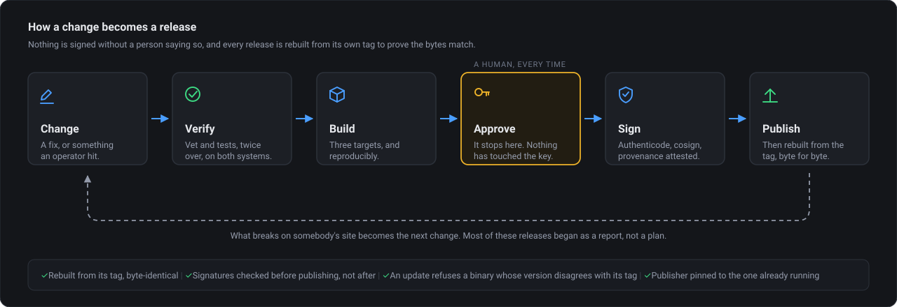
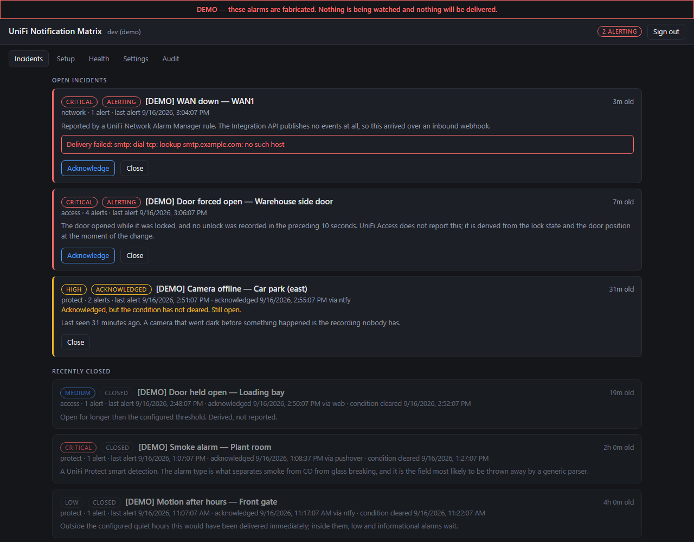
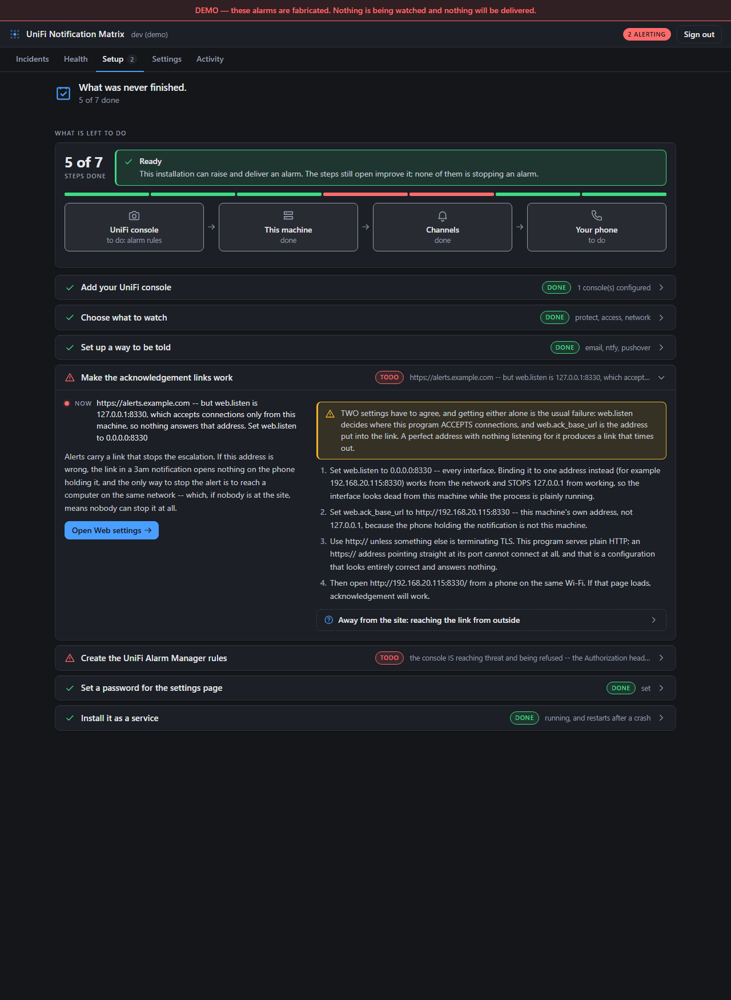
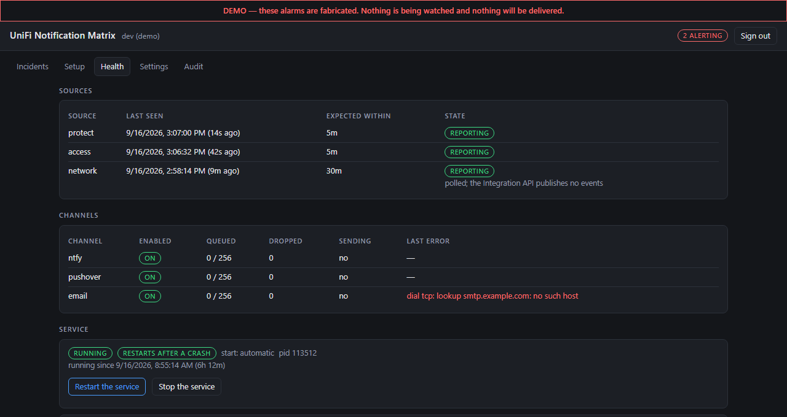
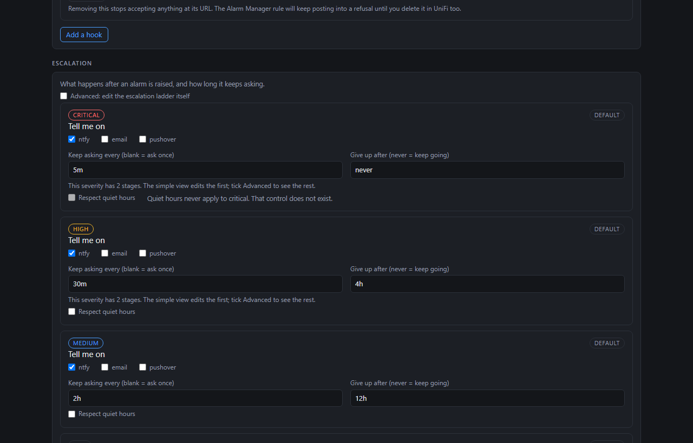
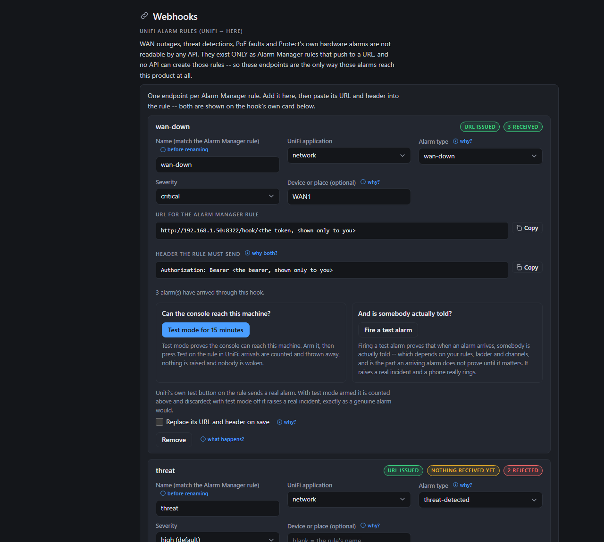
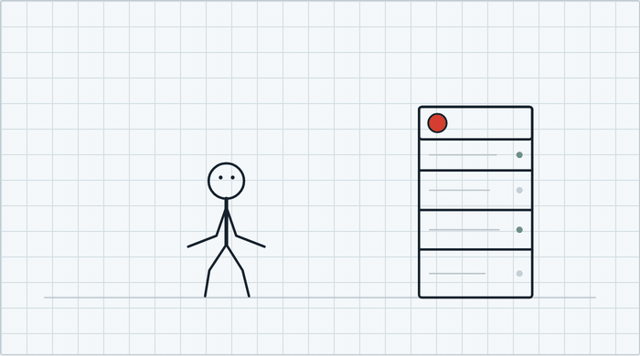

# UniFi Notification Matrix

<p align="center">
  <a href="https://github.com/suburbazine/Unifi-Notification-Matrix/releases/latest/download/notifymatrix-windows-amd64.exe"></a>
  <a href="https://github.com/suburbazine/Unifi-Notification-Matrix/releases/latest/download/notifymatrix-linux-amd64"></a>
  <a href="https://github.com/suburbazine/Unifi-Notification-Matrix/releases/latest/download/notifymatrix-linux-arm64"></a>
</p>

<p align="center">
  <a href="https://github.com/suburbazine/Unifi-Notification-Matrix/releases"></a>
  <a href="https://github.com/suburbazine/Unifi-Notification-Matrix/releases"></a>
  <a href="https://github.com/suburbazine/Unifi-Notification-Matrix/actions/workflows/ci.yml"></a>
  
  <a href="LICENSE.md"></a>
</p>

<p align="center">
  <sub>
    Windows binaries are Authenticode-signed and timestamped; every binary
    ships a Sigstore bundle and SLSA provenance.<br>
    <b><a href="#verifying-a-download">Check what you downloaded</a></b> —
    it takes one command, and this is a program you are about to give
    a view of your cameras and doors.
  </sub>
</p>

<p align="center">
  
</p>

> **Status: all three products ingest.** Protect, Access and Network.
> Built and tested: the incident lifecycle, the durable store, the escalation
> scheduler, the rule engine, acknowledgement, the secret store, configuration,
> the three sources, inbound webhooks, the ingest supervisor and its deadman,
> the ntfy, email, Pushover and outbound-webhook channels, the audit record,
> the local web UI and its editors, the capability probe, the setup checklist,
> the signed in-app updater, and Windows-service / systemd integration.
>
> **The top rung can now telephone you.** The voice channel places a Twilio call
> that speaks the alert and hangs up. It is opt-in — on no default ladder, since
> billed calls at 3am are not a default worth choosing for anybody — and it
> costs money per call.
>
> Not built yet: **acknowledging a call from the handset.** There is no "press
> 1"; a call wakes somebody, and the incident is still acknowledged from another
> channel or from the interface. Nor is live config reload — channels, policies
> and rules are built at start, so a saved change needs a restart, and the
> interface has a button for that.

UniFi tells you a thing happened. Once.

If nobody was looking at their phone in that minute, the event is gone — no
re-alert, no acknowledgement, no record that a human ever saw it. For
convenience notifications that is fine. For a door forced open at 3am, or a
camera that went dark an hour before a break-in, it is the whole failure.

**This turns a one-shot UniFi event into a tracked incident that keeps
escalating until a human closes it.**

<p align="center">
  
</p>



The board is the product. Note the third row: **acknowledged, and still open.**
A notification is gone once it has been seen; an incident is not finished until
the condition clears, and the difference is the reason this exists.

### Look at it before you install it

```
notifymatrix demo
```

Opens the real interface over a fabricated site — no console, no API key, no
camera, nothing pointed at your doors. Every screenshot on this page is that
demo. It refuses to run against a real installation, never constructs a
channel, and marks every screen and every incident as fabricated, because an
alarm you cannot distinguish from a real one is how real ones stop being
believed.

- Ingests from UniFi **Protect**, **Access** and **Network** — the API where
  one exists, and an inbound webhook for the alarms that exist nowhere else.
- **Tells you what is left to configure**, checked against your real setup:
  `notifymatrix setup`. It can tell "configured" from "actually working".
- **Derives the two door alarms UniFi Access does not report at all**: a door
  forced open, and a door held open past a threshold. Neither exists as a
  readable value on any Access surface.
- Escalates on a policy ladder that widens over time: push, then email, then —
  if you put it on a rung yourself — an automated phone call.
- **Acknowledgement works from a phone with one tap**, no login required.
  For somebody off-site, a second listener carrying *only* the acknowledgement
  route can be pinned to a random high port — so a firewall forward has
  something safe to point at instead of publishing your status page.
- **Notices its own sources dying.** Every source declares how long its silence
  may last, and silence past that becomes an incident — because a dead source
  and a quiet site look identical from outside.
- Fans out to **ntfy**, **email**, **Pushover** and a **generic JSON webhook**
  — so it slots into whatever you already run. And to a **phone call** via
  Twilio, for the rung below *nobody is answering*: it speaks the alert and
  hangs up, rings through a Do Not Disturb schedule, costs money every time, and
  is on no ladder until you name it on one.
- Every channel has a **"send a test" button** that reports what actually
  happened to that attempt, including the service's own error text. Voice is the
  exception and says so on the button: it checks the Twilio credentials and
  places no call, because a test that costs money and rings somebody is not a
  harmless one.
- A **local web UI**: status is visible to anyone on the LAN so it works as a
  wall display, and every change requires a password.
- An **append-only audit record** in plain JSONL — including the events a rule
  *silenced*, because "why was I not paged" is the hard question.
- A **capability probe** that asks your console what it actually exposes, so
  firmware revisions nobody here has seen can still be described. See below.
- Runs as a Windows service or a systemd unit. Single static binary, no runtime
  to install.
- API keys are encrypted at rest — **DPAPI** on Windows, and a machine-bound
  equivalent on Linux.

**New here? [docs/SETUP.md](docs/SETUP.md) walks through a first installation
from nothing.**

It also installs on a UniFi gateway itself, which is
[documented](docs/GATEWAY.md) and **not recommended** — see the bottom of this
page for why.

See [docs/ARCHITECTURE.md](docs/ARCHITECTURE.md) for the design,
[docs/SOURCES.md](docs/SOURCES.md) for what each UniFi application actually
exposes, and [docs/DESIGN-RULES.md](docs/DESIGN-RULES.md) for the rules the
code follows and why.

---

## The alarms that need a rule made by hand

Some UniFi alarms are **not readable by any API**: WAN outages, threat
detections and PoE faults in Network; disk failure, storage and power loss in
Protect. They exist only as **Alarm Manager** rules that push to a URL — and no
API can create those rules, so nothing can provision them for you.

This product is designed *for* that rather than around it. You add a hook, it
generates a URL, you paste that URL into the rule, and then:

```
 check 5. Create the UniFi Alarm Manager rules
        now: configured, but nothing has ever arrived at wan-offline
             -- the rule may not exist yet
```

A hook that looks right is not evidence that anybody made the rule, so the
checklist reports it as **unverified** until an alarm actually arrives. Press
Test in UniFi and it changes to done.


---

## What it can and cannot see on UniFi Access

Access is the product with the largest gap between what you would expect and
what it reports, so it is worth being explicit.

**Derived here, because Access reports neither:**

| Alarm | How |
|---|---|
| Door forced open | The door became open *while locked*, with no unlock shortly before it. Decided on the transition, not the current state — "locked and open" is also where an ordinary entry ends up on a fast-relocking lock. |
| Door held open | The door position has read open for longer than the threshold (60s by default). |

**Read from the system log:** denied credentials, and the console's own
`critical` topic. The log lags by up to ~3.5 minutes, so the poll floor is
three minutes and rows are de-duplicated by row id rather than by time.

**Not offered, because the feature does not exist in Access:**
anti-passback (an unshipped roadmap item since 2022), tamper (no representation
on any surface), and battery-low (the line is entirely PoE). A rule that can
never fire is worse than no rule.

> **Most doors cannot be watched this way.** Forced and held both need a door
> position sensor, and `door_position_status` reads `"none"` on any door
> without one — a measurement across 28 doors on one console found 26 of them.
> The status page reports how many of your doors actually have a sensor, so
> this is visible rather than assumed.


---

## What the interface actually shows

**Setup tells you what is left**, checked against the running system rather
than against the config file — so "configured" and "actually working" are
different answers.



Only the step you are on is open. The rest collapse to a line and a state, and
the pipeline across the top says which end of the chain is unfinished -- here
the console has no Alarm Manager rule yet, so it is the console node that is
marked, not the machine.

Each hook's URL and header live on that hook's own card, and only for a
signed-in viewer: they carry the token, so anyone holding one can raise an
alarm on your system.

**Health answers "why is nothing happening"** — per source, per channel, and
whether the service will come back on its own.



A channel that has started failing is on the screen, not buried in a log. So is
the difference between "starts at boot" and "restarts after a crash", which are
different mechanisms and only one is on by default.

**Escalation is a matrix**, which is what the product is named for. Severities
down, channels across, how often it keeps asking and when it gives up beside
them — with the full ladder behind an Advanced tick for anyone who wants "ntfy
now, ntfy and email in fifteen minutes".



**Inbound hooks are managed here too** — one endpoint per Alarm Manager rule,
because that is the only way UniFi Network alarms exist at all.



Each hook can be proved two ways, and they answer different questions. Test
mode accepts an arrival and throws it away, so you can press Test in UniFi
without waking anybody. Firing a test alarm sends a real one through your
rules, your ladder and your channels, which is the half an arriving alarm never
proves until the night it matters.

## What it can tell you about

[docs/CONDITIONS.md](docs/CONDITIONS.md) lists every condition this build
understands -- what each means and which surface produces it. It is generated
from the code and checked by a test, so it cannot quietly drift from what the
program actually does. The Rules editor offers the same list.

## The capability probe

UniFi's surfaces are version-gated and under-observed. Protect's event
vocabulary went from 16 types to 39 between firmware revisions; Network's alarm
payload has spelled its message field four different ways. Documentation does
not fix that — observing real consoles does.

```bash
notifymatrix probe --host 192.168.1.1
```

It asks your console which endpoints answer and listens on each push socket,
then writes a JSONL report saying what this build does not handle (`NEW`) and
what it expects that your firmware does not have (`GONE`). It is useful on its
own, and you may choose to contribute it.

**Three things about it are worth knowing before you run it.**

**It only talks to local networks.** RFC 1918, loopback, link-local, IPv6 ULA
and Tailscale's range. Nothing else, enforced in the dialer against the actual
socket address rather than the hostname, on both the HTTP and WebSocket paths.
There is no flag to widen it — a probe pointed at an address you do not own is
an unauthorised scan run from your machine and your address.

**Nothing identifying reaches the file.** A raw probe of a UniFi console is a
map of your building: camera names are room names, door names are door names.
So names, MACs, IPs, ids, tokens and timestamps are replaced with meaningless
per-report counters *at capture time*, before anything is written. What
survives is field names, structure, types, UniFi's own vocabulary
(`smartDetectZone`, `CONNECTED`) and your firmware version — which is all a
schema contribution needs.

**Nothing is uploaded.** Contributing is a separate command that prints the
entire file first, so you read the exact bytes before deciding:

```bash
notifymatrix probe submit
```

If anything in that output identifies your site, that is a bug in this tool and
reporting it matters more than the contribution does.

[CONTRIBUTING.md](CONTRIBUTING.md) covers what else is worth sending, what is
likely to be declined, and what happens to code you contribute — which matters
here, because commercial licences to this product are sold separately.


---

## Licence — read this before you integrate

This project is **source-available, not open source.** It is licensed under the
[PolyForm Noncommercial License 1.0.0](LICENSE.md).

**You may** use, modify and distribute it for any noncommercial purpose —
personal use, hobby projects, research and study, and use by charities,
educational institutions, public research bodies, public safety and health
organisations, environmental organisations, and government institutions,
regardless of how they are funded.

**You may not** use it for a commercial purpose without a separate commercial
licence. That includes deploying it at a business, using it to deliver a paid
service, or bundling it into a product you sell.

Commercial licensing: **licensing@xtremission.com**

The same address takes security reports — see
[SECURITY.md](SECURITY.md), and put *security* in the subject.

GitHub labels this repository "Other" because PolyForm is not an OSI-approved
licence. That is expected, not an error.

---

## Building

Requires **Go ≥ 1.26**. No other toolchain.

```
go build ./cmd/notifymatrix
```

Builds are `CGO_ENABLED=0` by design — it produces static binaries that run
anywhere including Alpine and Docker, and it keeps releases reproducible enough
that you can verify a published binary matches its tag.

Builds are reproducible: from a clean clone at the same tag, with the Go
version in `.go-version`,
`go build -trimpath -ldflags "-s -w -buildid= -X main.version=…"` produces the
released bytes exactly — verified against a published release, not assumed. That is the point of publishing source for
a security tool — source nobody can check against the binary buys very little.

## Verifying a download

Released binaries are signed. The strongest check needs no key trusted in
advance, and proves **which workflow in which repository** built the file:

```bash
cosign verify-blob notifymatrix-linux-amd64 \
  --bundle notifymatrix-linux-amd64.sigstore.json \
  --certificate-identity-regexp '^https://github\.com/suburbazine/Unifi-Notification-Matrix/' \
  --certificate-oidc-issuer https://token.actions.githubusercontent.com
```

Download the `.sigstore.json` alongside the binary — it holds the signature,
the signing certificate and the transparency-log proof in one file.

```bash
gh attestation verify notifymatrix-linux-amd64 --repo suburbazine/Unifi-Notification-Matrix
```

On Windows the `.exe` is Authenticode-signed and timestamped
(`Get-AuthenticodeSignature`). Full instructions — including how to rebuild
from source and compare hashes yourself — are in
[docs/RELEASING.md](docs/RELEASING.md).

What changed in each release is in [CHANGELOG.md](CHANGELOG.md), and on the
release page itself. Every release has an entry: the build refuses a tag
without one.

> Do not drop `--certificate-identity-regexp`. Without an identity constraint
> cosign verifies a signature from *anyone*, which proves nothing about who
> built your binary.

---

## Reporting a security problem

Mail **licensing@xtremission.com** — a secure mailbox, so the details can go in
the first mail — or use GitHub's private reporting if you would rather keep the
thread there:
**[Report a vulnerability](https://github.com/suburbazine/Unifi-Notification-Matrix/security/advisories/new)**.
Not a public issue, please, for anything that would tell somebody how to reach
a stranger's installation before there is a fix to point at.

[SECURITY.md](SECURITY.md) says what is in scope, what is already known and
written down rather than overlooked, and what happens after you send it.

---

## Yes, it runs on the UniFi gateway itself

<p align="center">
  <picture>
    <source media="(prefers-color-scheme: dark)" srcset="docs/images/whats-this-button-do-dark.gif">
    
  </picture>
</p>

**Because it could, not because it should.**

Somebody was always going to press the button, so it may as well work
properly: it detects the platform, refuses to install where it would take
memory from routing and inspection, and tells you at **every start** exactly
what you gave up.

What you gave up is the whole point. Hosted on the gateway, this daemon
**shares fate with the equipment it is watching** — so when that box reboots,
wedges or loses power, the one alarm that matters most is the one it
structurally cannot send. Pair a peer at another site, or point an off-site
heartbeat at it, and the problem goes away.

[docs/GATEWAY.md](docs/GATEWAY.md) is the supported way to do an unrecommended
thing, which is a different promise from a recommendation and a smaller one.
The daemon has since run on a real gateway — a UCG-Fiber on UniFi OS 6 —
which turned up four bugs no test written for them could reach. What is still
untested is a firmware upgrade, and the page says so rather than reasoning its
way to an answer it has not seen.

---

Copyright (c) 2026 Xtremission LLC
